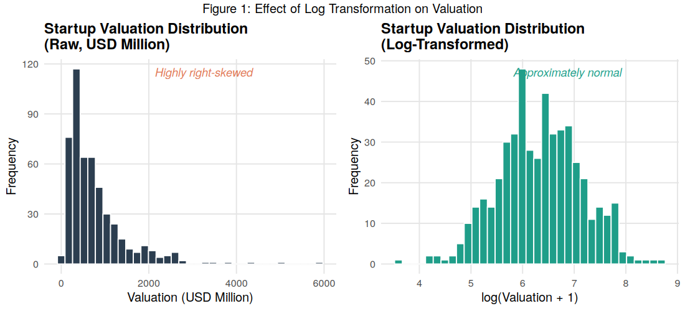
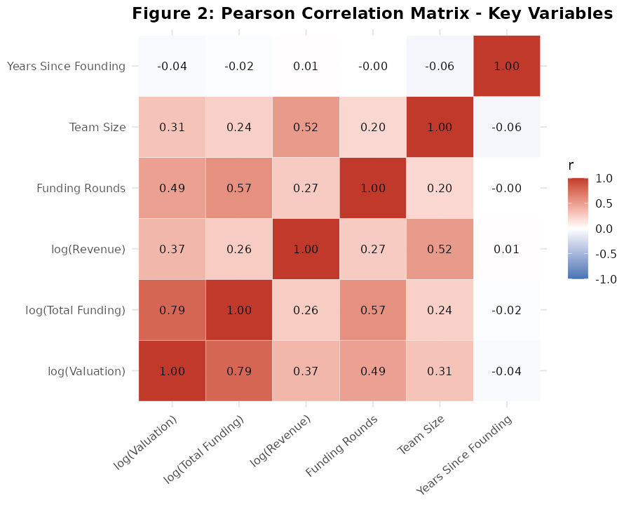
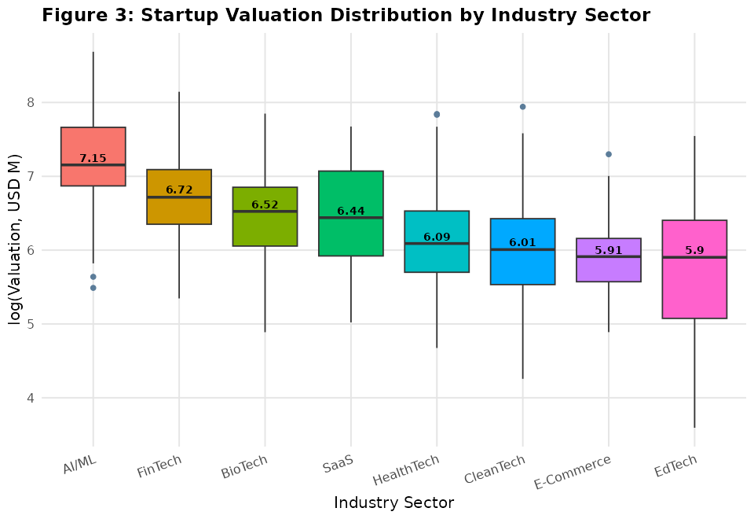
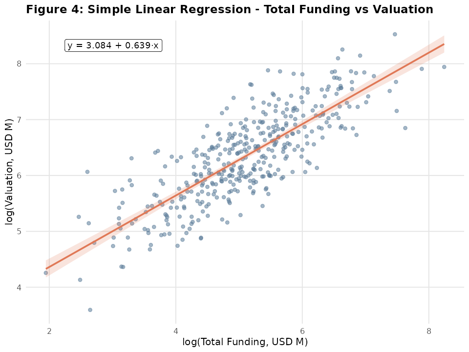
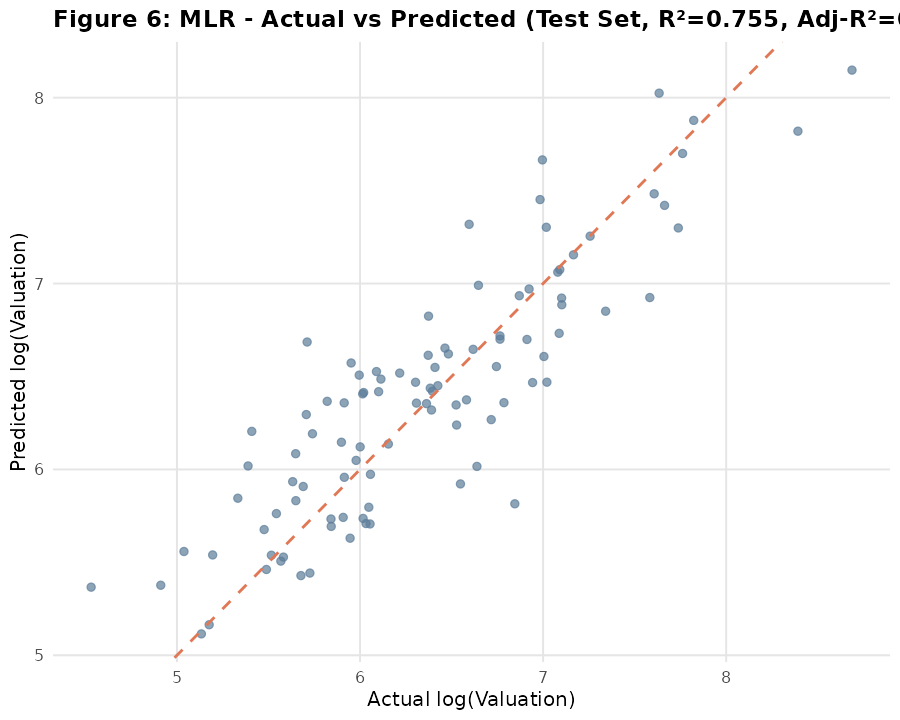
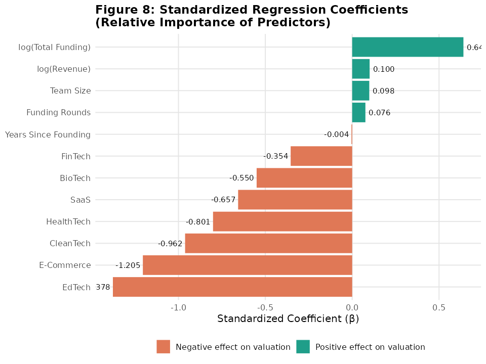
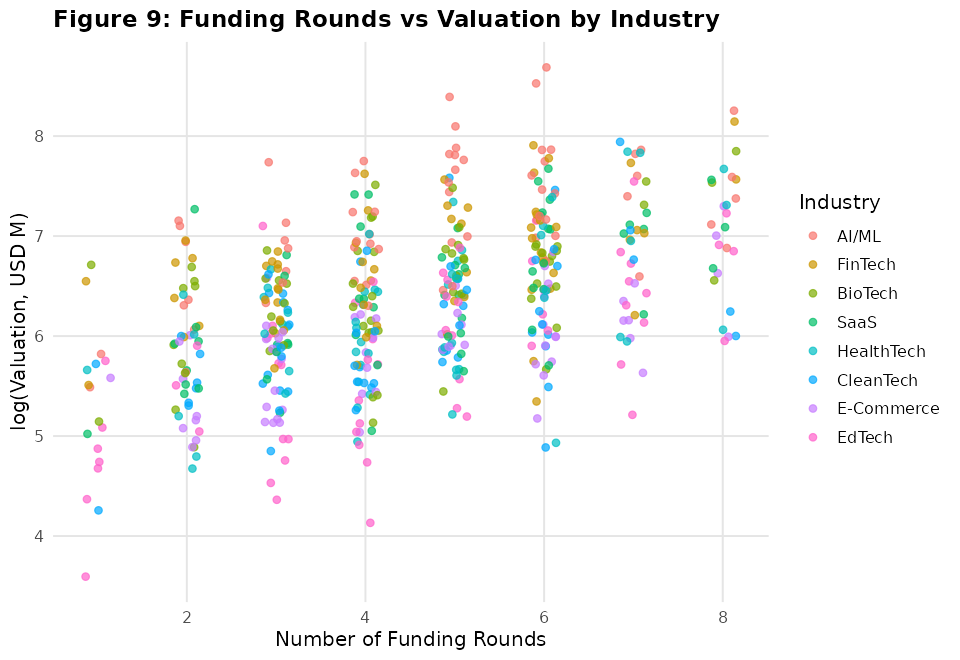
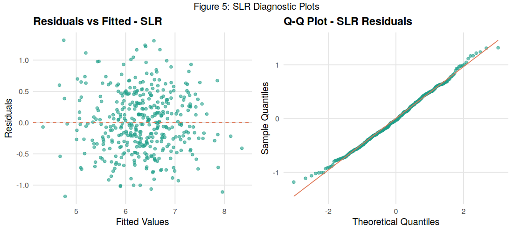
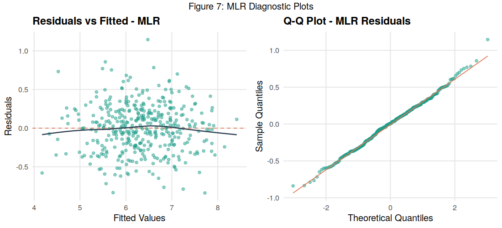
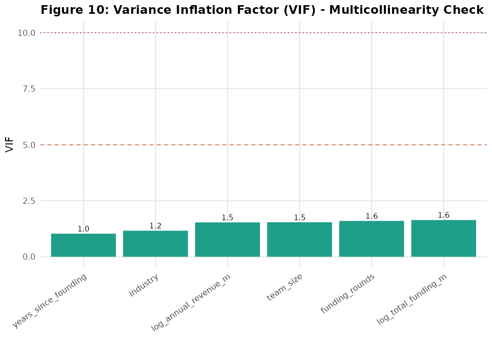

# 📈 What Influences Startup Valuation?

### Statistical Modeling of Startup Valuation Using Linear Regression in R

An end-to-end statistical analysis exploring how **funding, revenue, team size, company maturity, funding activity, and industry** relate to startup valuation.

The project moves from **Exploratory Data Analysis (EDA)** to **Simple Linear Regression (SLR)** and **Multiple Linear Regression (MLR)**, followed by model diagnostics, predictor interpretation, and out-of-sample evaluation.

> **Key Result:** The multiple regression model explains approximately **85.5% of the variation in log startup valuation on the training data** and achieves a **test R² of ~0.755**, substantially outperforming a funding-only baseline.

---

## 🎯 The Question

Startup valuations are influenced by far more than how much capital a company has raised.

This analysis investigates:

> **Which measurable startup characteristics are most strongly associated with valuation, and how much explanatory power do they provide?**

The analysis considers factors including:

- Total funding
- Revenue
- Team size
- Company age
- Number of funding rounds
- Industry

The goal is not only to fit a regression model, but to **understand the statistical relationships behind startup valuation and evaluate whether those relationships generalize to unseen data.**

---

## 📊 Analysis at a Glance

| Model | Train R² | Adjusted R² | Test R² | Test RMSE | Test MAE |
|:---|---:|---:|---:|---:|---:|
| Simple Linear Regression | 0.650 | 0.649 | 0.489 | 0.543 | 0.445 |
| **Multiple Linear Regression** | **0.855** | **0.850** | **0.755** | **0.376** | **0.296** |

The multiple regression model produces a substantial improvement over the funding-only baseline.

**Test R² increases from 0.489 → 0.755**, while both RMSE and MAE decrease.

---

# 🔎 Exploratory Data Analysis

Before modeling, the dataset was examined for distributional characteristics, relationships between numerical variables, and differences across startup industries.

## Distribution & Log Transformation

Startup financial variables tend to be strongly right-skewed: a relatively small number of companies can have valuations, revenues, or funding amounts far larger than the majority.

Log transformations were therefore used to reduce skewness and make relationships more suitable for linear modeling.

<p align="center">
  
</p>

<p align="center">
  <i>Distributional behavior before and after log transformation.</i>
</p>

---

## Relationships Between Startup Characteristics

A correlation analysis was used to examine how numerical startup characteristics move together, while industry-level comparisons provide context for differences in valuation across sectors.

<table>
<tr>
<td width="50%" valign="top">

</td>
<td width="50%" valign="top">

</td>
</tr>
<tr>
<td align="center"><b>Correlation Structure</b></td>
<td align="center"><b>Valuation Across Industries</b></td>
</tr>
</table>

These exploratory relationships help identify promising predictors while also highlighting why valuation should not be explained through a single variable alone.

---

# 📉 Baseline Model — Simple Linear Regression

The first model establishes a baseline using **total funding as the primary predictor of startup valuation**.

This asks a simple question:

> **How much of startup valuation can be explained by funding alone?**

<p align="center">
  
</p>

<p align="center">
  <i>Relationship between funding and valuation under the simple regression model.</i>
</p>

### Baseline Performance

The Simple Linear Regression model achieves:

- **Train R²:** 0.650
- **Adjusted R²:** 0.649
- **Test R²:** 0.489
- **Test RMSE:** 0.543
- **Test MAE:** 0.445

Funding alone therefore captures a meaningful portion of valuation variation, but its weaker performance on unseen data suggests that **valuation depends on additional startup characteristics**.

---

# 🚀 Multiple Linear Regression

The analysis was expanded to a Multiple Linear Regression model incorporating additional company-level and industry-level information.

Conceptually, the model estimates valuation using:

```text
Funding
+ Revenue
+ Team Size
+ Company Age
+ Funding Rounds
+ Industry
```

This allows the relationship between each predictor and valuation to be examined **while controlling for the other variables in the model**.

## Actual vs Predicted Valuation

<p align="center">
  
</p>

<p align="center">
  <i>Actual vs predicted log valuation under the Multiple Linear Regression model.</i>
</p>

Predictions clustering closer to the ideal relationship indicate substantially stronger explanatory performance than the single-predictor baseline.

---

# ⚖️ SLR vs MLR

The progression from a funding-only model to a multivariable model produces a clear improvement.

| Metric | SLR | MLR | Improvement |
|:---|---:|---:|:---|
| Train R² | 0.650 | **0.855** | Higher explained variance |
| Adjusted R² | 0.649 | **0.850** | Improvement remains after accounting for additional predictors |
| Test R² | 0.489 | **0.755** | Stronger generalization |
| Test RMSE | 0.543 | **0.376** | Lower prediction error |
| Test MAE | 0.445 | **0.296** | Lower average absolute error |

### Key Takeaway

> **Funding matters, but funding alone does not tell the full story.**

Adding company and industry characteristics raises held-out R² from approximately **0.49 to 0.76**, showing that startup valuation is better represented as a **multifactor relationship**.

---

# 🧠 What Drives Startup Valuation?

Regression coefficients can be difficult to compare directly when predictors use different units.

To improve interpretability, standardized coefficients were examined to compare the relative contribution of predictors on a common scale.

<p align="center">
  
</p>

<p align="center">
  <i>Relative contribution of predictors based on standardized regression coefficients.</i>
</p>

## Main Findings

**Total Funding** emerges as the strongest predictor, with a standardized coefficient of approximately **β ≈ 0.64**.

**Industry** also contributes meaningful information, indicating that startups operating in different sectors can exhibit valuation premiums or discounts even after accounting for other company characteristics.

**Company Age** becomes less informative after controlling for funding stage and other predictors, suggesting that simply being older does not necessarily imply a higher valuation.

Overall, the results suggest that valuation reflects a combination of **capital raised, company characteristics, and industry context** rather than maturity alone.

---

# 🏭 Industry & Funding Activity

Industry-level differences were explored further by examining funding-round activity across sectors.

<p align="center">
  
</p>

<p align="center">
  <i>Variation in funding activity across startup industries.</i>
</p>

This provides additional context for interpreting industry effects in the regression model: sectors can differ not only in valuation, but also in their typical funding trajectories.

---

# 🩺 Regression Diagnostics

A high R² alone is not sufficient evidence of a reliable regression model.

Diagnostic analysis was therefore performed to assess model behavior and check whether important linear regression assumptions were being violated.

<table>
<tr>
<td width="50%" valign="top">

</td>
<td width="50%" valign="top">

</td>
</tr>
<tr>
<td align="center"><b>SLR Diagnostics</b></td>
<td align="center"><b>MLR Diagnostics</b></td>
</tr>
</table>

The diagnostic workflow examines areas such as:

- Linearity
- Residual behavior
- Normality
- Constant variance
- Potential influential observations

---

## Multicollinearity

Because the multiple regression model contains several related startup characteristics, multicollinearity was assessed using **Variance Inflation Factors (VIF)**.

<p align="center">
  
</p>

<p align="center">
  <i>VIF analysis for predictors included in the multiple regression model.</i>
</p>

This step helps ensure that coefficient interpretation is not being distorted by excessive linear dependence among predictors.

---

# 🔬 Methodology

The analysis follows a reproducible statistical modeling workflow:

**1. Data preparation**  
The startup dataset was loaded, inspected, cleaned, and prepared for statistical analysis.

**2. Exploratory analysis**  
Variable distributions, correlations, industry differences, and funding patterns were examined.

**3. Transformation**  
Highly skewed financial variables were log-transformed to improve distributional behavior and linear model suitability.

**4. Baseline modeling**  
Simple Linear Regression was used to quantify the relationship between funding and valuation.

**5. Multivariable modeling**  
Multiple Linear Regression incorporated additional startup characteristics and industry information.

**6. Statistical interpretation**  
Model coefficients, significance, standardized effects, and overall explanatory power were evaluated.

**7. Diagnostics**  
Residual behavior, regression assumptions, influential observations, and multicollinearity were assessed.

**8. Out-of-sample evaluation**  
Models were compared using held-out test data with R², RMSE, and MAE.

---

# 🛠 Tech Stack

| Area | Tools |
|:---|:---|
| Language | **R** |
| Data Manipulation | `dplyr`, `tidyr` |
| Visualization | `ggplot2` |
| Statistical Modeling | `lm()` |
| Model Evaluation | R², Adjusted R², RMSE, MAE |
| Diagnostics | Residual analysis, VIF |
| Reproducibility | Script-based analysis pipeline |

---

# 📁 Repository Structure

```text
startup_valuation_analysis/
│
├── R/
│   ├── 00_simulate_dataset.R
│   ├── 01_preprocessing.R
│   ├── 02_eda.R
│   ├── 03_simple_linear_regression.R
│   ├── 04_multiple_linear_regression.R
│   ├── 05_model_comparison.R
│   └── utils.R
│
├── data/
│   ├── raw/
│   │   ├── README.md
│   │   └── investments_VC.csv.zip
│   │
│   └── processed/
│       ├── startup_valuation_clean.csv
│       ├── startup_valuation_data.csv
│       ├── train.csv
│       └── test.csv
│
├── outputs/
│   ├── figures/
│   │   ├── fig1_log_transformation.png
│   │   ├── fig2_correlation_matrix.png
│   │   ├── fig3_valuation_by_industry.png
│   │   ├── fig4_slr_scatter.png
│   │   ├── fig5_slr_diagnostics.png
│   │   ├── fig6_mlr_actual_vs_predicted.png
│   │   ├── fig7_mlr_diagnostics.png
│   │   ├── fig8_standardized_coefficients.png
│   │   ├── fig9_funding_rounds_by_industry.png
│   │   └── fig10_vif.png
│   │
│   └── tables/
│       ├── correlation_matrix.csv
│       ├── descriptive_stats.csv
│       ├── industry_median_valuation.csv
│       ├── mlr_coefficients.csv
│       ├── mlr_model.rds
│       ├── model_comparison.csv
│       ├── slr_model.rds
│       ├── slr_summary.csv
│       ├── standardized_coefficients.csv
│       └── vif_table.csv
│
├── install_packages.R
├── run_all.R
├── SESSION_INFO.txt
├── .gitignore
├── LICENSE
└── README.md
```

---

### How the Pipeline Is Organized

The repository follows a sequential and reproducible analysis workflow:

`Raw Data` → `Preprocessing` → `EDA` → `SLR` → `MLR` → `Model Comparison` → `Outputs`

- **`R/`** contains the modular analysis pipeline, from data preparation through model comparison.
- **`data/raw/`** stores the original source data and its documentation.
- **`data/processed/`** contains cleaned data along with the reproducible train/test split used for modeling.
- **`outputs/figures/`** contains all visualizations generated during EDA, modeling, and diagnostics.
- **`outputs/tables/`** stores statistical summaries, fitted model objects, coefficients, VIF results, and model-comparison metrics.
- **`run_all.R`** executes the complete analysis pipeline.
- **`install_packages.R`** installs the R dependencies required to reproduce the project.
- **`SESSION_INFO.txt`** records the package and environment versions used for reproducibility.

---

# ▶️ Reproducing the Analysis

Clone the repository:

```bash
git clone <repository-url>
cd startup_valuation_analysis
```

Open the project in R/RStudio and install any required packages that are not already available.

Run the analysis pipeline from the project root.

The workflow will generate the statistical results and visualizations stored under:

```text
outputs/
└── figures/
```

---

# 💡 Key Insights

The analysis leads to three main conclusions:

1. **Funding is strongly associated with startup valuation**, but it is not sufficient by itself to explain valuation differences.

2. **A multivariable approach performs substantially better**, increasing held-out R² from **0.489 to 0.755** while reducing prediction error.

3. **Industry and company characteristics provide information beyond funding**, reinforcing that startup valuation is a multidimensional phenomenon.

---

# ⚠️ Interpretation & Limitations

The regression models identify **statistical associations**, not causal effects.

A significant coefficient does not imply that changing a predictor will directly cause startup valuation to change by the estimated amount.

Potential limitations include:

- Omitted variables that may influence valuation
- Industry-specific market dynamics
- Extreme valuations and influential observations
- Relationships that may not be fully linear
- Dataset-specific sampling effects

The results should therefore be interpreted as evidence about **relationships within the available data**, rather than causal estimates of startup value.

---

# 🔮 Future Extensions

This statistical analysis provides a strong baseline for extending the project into a broader startup valuation modeling system.

Potential next steps include:

- Regularized regression with **Ridge, Lasso, and Elastic Net**
- Tree-based models such as **Random Forest and Gradient Boosting**
- Feature engineering around funding efficiency and growth
- Cross-validation and systematic model selection
- Explainability using feature importance and SHAP
- Startup valuation prediction through an interactive interface
- Automated data ingestion and model retraining

---

## 📌 Final Takeaway

> Startup valuation cannot be reduced to a single metric.

Funding provides the strongest individual signal in this analysis, but combining financial, operational, and industry information produces a substantially stronger model.

The project demonstrates the complete statistical workflow from **EDA → transformation → regression → diagnostics → interpretation → out-of-sample evaluation**, with an emphasis on understanding *why* the model behaves as it does rather than treating prediction performance as the only objective.

---

## Author

**Kanika Pitaliya**

M.Sc. Data Analytics

GitHub: https://github.com/kanikapitaliya

---
